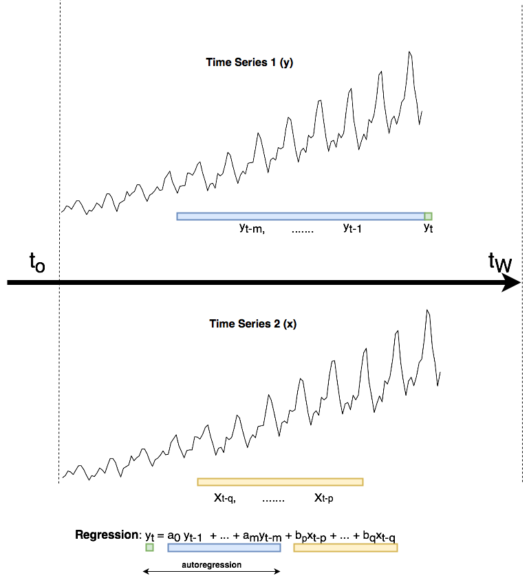
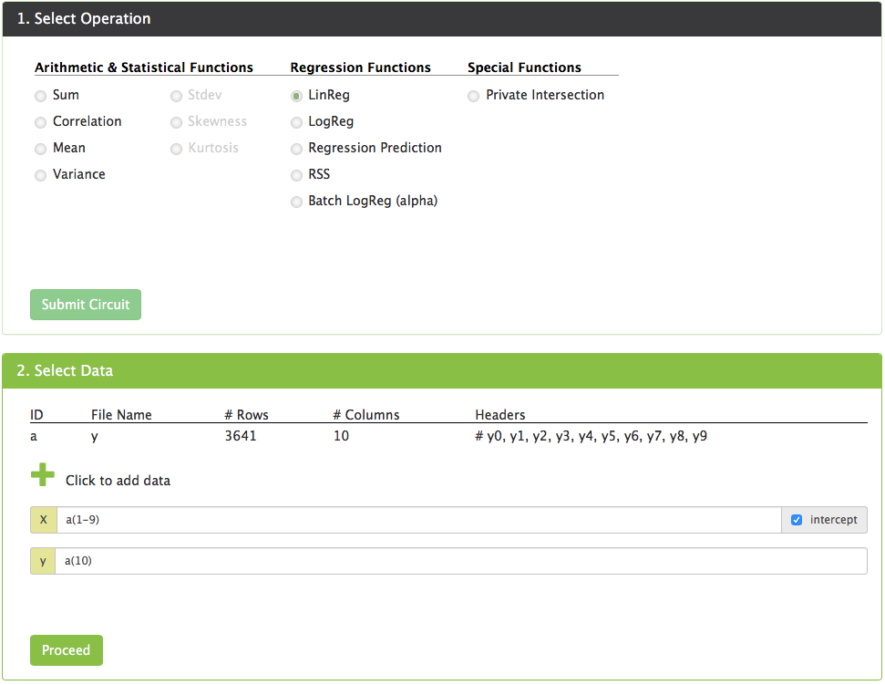
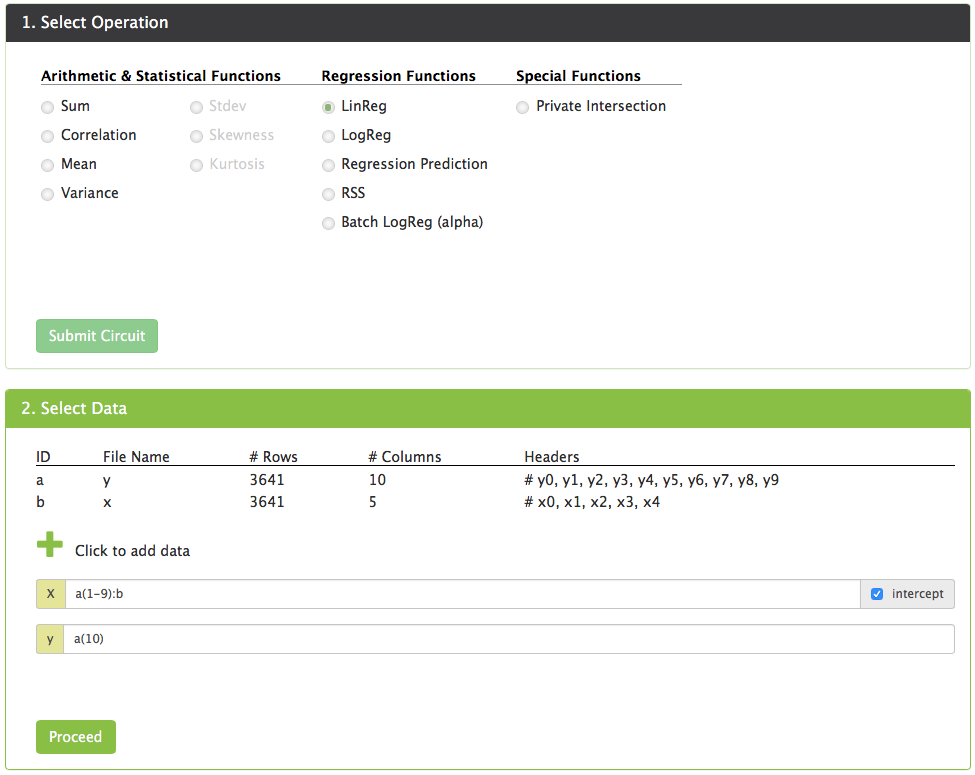
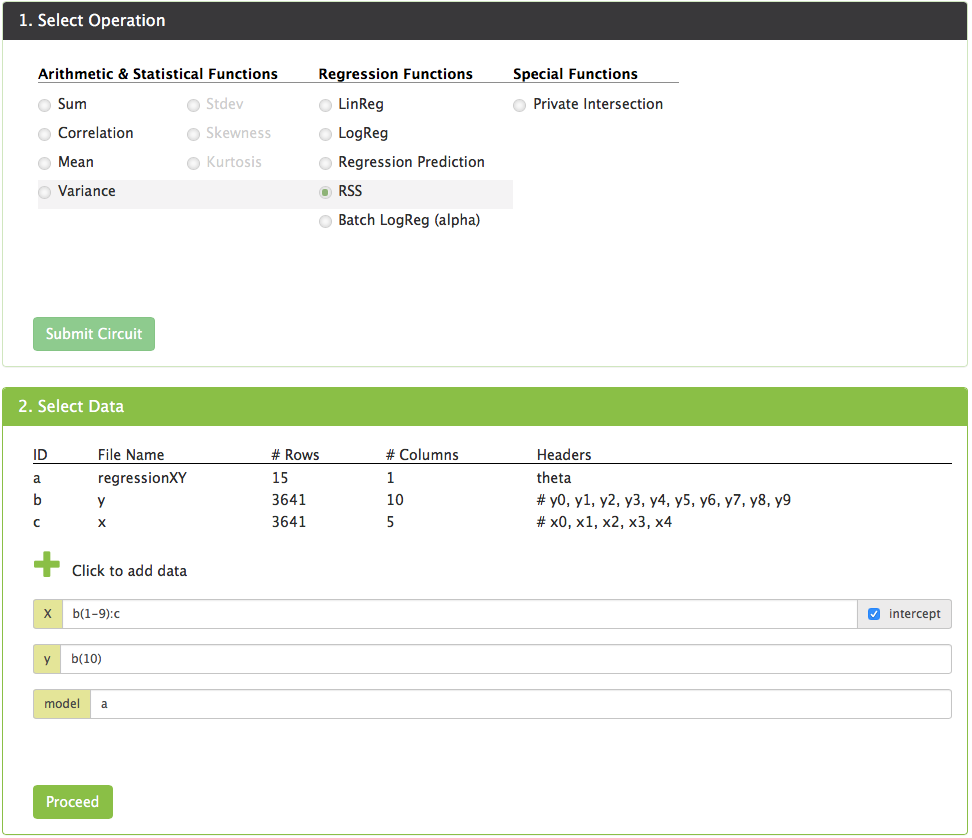

# Granger Causality

The goal is to understand wether an additional time series x improves the prediction of time series y. In order to do that, the autoregression is compared to the regression using both time series. Using XOR secret computing, time series x can remain completely private which allows the private discovery of model improving datasets. 

## Overview



## Preprocessing XOR inputs to compute regression

Each row `i` for `t = i` of the input csv shall contain the following information

| x<sub>i-q</sub> | ... | x<sub>i-p</sub> | y<sub>i-m</sub> | ... | y<sub>i</sub> |
| --- | --- | --- | --- | --- | --- |

*Requirements*:
* both time series have the same sampling frequency
* both time series last row (most recent sample) correspond to the same time
* `p (lag_min) <= q (lag_max)`
* the length of the time series is stricly larger than the window size `m` and upper bound `q (lag_max)`

### Preprocessing Script
The [grangerPreprocessing.py](./grangerPreprocessing.py) script can be used to transform a time series csv in to the format mentioned above.


```
usage: grangerPreprocessing.py [-h] --input INPUT [--output OUTPUT]
                               [--column COLUMN] --player PLAYER --lag-upper
                               LAG_UPPER --lag-lower LAG_LOWER --window-size
                               WINDOW_SIZE

Preprocesses a time series for the computation of granger causality using XOR
Secret Computing

optional arguments:
  -h, --help                show this help message and exit
  --input INPUT             path for input time series (.csv)
  --output OUTPUT           path for output (.csv)
  --column COLUMN           column containing the y of the time series (integer)
  --lag-max LAG_MAX         upper bound lag q (integer)
  --lag-min LAG_MIN         lower bound lag p (integer)
```

## Example computation with XOR

For this example we will take two datasets:
* [The daily minimum temperatures in Melbourne (1981-1990)](http://bit.ly/2pIBicE)
* [The daily rainfall in Melbourne (1981-1990)](http://bit.ly/2McV1cp)

The goal is to find out if the daily rainfall (`y`) helps us predict the daily temperature (`x`) in Melbourne.

We assume that party one owns `y`, wheras party two owns `x`.

Here we set the following:
* `lag lower bound <= 1 day`
* `lag upper bound <= 5 days`
* `window size for autocorrelation <= 10 days`

### Preprocessing

Party one will run the following code locally:

```
python3 grangerPreprocessing.py \
  --input 'daily-minimum-temperatures-in-melbourne-aust.csv' \
  --lag-min 0 \
  --lag-max 10 \
  --output 'y.csv'
```

Party two will run the following code locally:

```
python3 grangerPreprocessing.py \
  --input 'daily-rainfall-in-melbourne-aust.csv' \
  --lag-min 1 \
  --lag-max 5 \
  --output 'x.csv'
```

The resulting csv files will be copied/linked to the `privatedata` folder of the xor-machines.

### Running the autoregression

On the xor portal, run the autoregression. You can also run the auto regression directly on the plaintext, as all the data needed for that computation belongs to party one.

Store the resulting model as `autoregression.csv`



### Running the regression using both time series

On the xor portal, run the regression using `x` and `y`. 

Store the resulting model as `regressionXY.csv`



### Computing the RSS of the autoregression


### Computing the RSS of the regression using both time series


### Computing `t` and `F` stats
Once we have computed the `b` least-square estimators (i.e., the coefficients in front of the `x` lags), we would like to determine if at least one of them is statistically significant. We can do that by computing the `t`-score for each one of them and use that to 
determine a `p`-value from Student's `t`-distribution. 

By definition, the `t` square is determined as a ratio of the (normalized) square root of the `RSS` and the standard deviation of the 
corresponding column of the `X` matrix (i.e., the corresponding lagged independent variable). Since the latter is public (publicly known at the time of the computation) and since we are able to compute the `RSS` and reveal it, one can compute the `t`-score in public. Once this is done, we determine the `p`-value and hence, the statistical significance of the coefficient. 

### Interpretation of the results
Once all the stats have been computed, the conclusion if `x` granger causes `y` through the following criteria: at least one of the lagged regression coefficients of `x` is significant according to the `t`-test.
